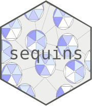

---
output:
  md_document:
    variant: markdown_github
---



# sequins

<!-- badges: start -->
<!-- badges: end -->

The goal of {sequins} is to provide a way to plot graphs depicting {glitter} queries. Learn more about {glitter} and how to use it to collect data from SPARQL endpoints [here](https://lvaudor.github.io/glitter/).

## Installation

You can install the development version of sequins from [GitHub](https://github.com/) with:

``` r
# install.packages("devtools")
devtools::install_github("lvaudor/sequins")
```

## Example

This is a basic example of how to use the function sequins::graph_query() to show a glitter query as a graph:

```{r}
library(glitter)
library(sequins)
query=spq_init() %>%
  spq_add("?mayor wdt:P31 ?species") %>%
  spq_set(species = c('wd:Q144','wd:Q146', 'wd:Q780')) %>%
  spq_add("?mayor p:P39 ?node") %>%
  spq_add("?node ps:P39 wd:Q30185") %>%
  spq_add("?node pq:P642 ?place") 

graph_query(query, layout="tree", label=TRUE)
```

